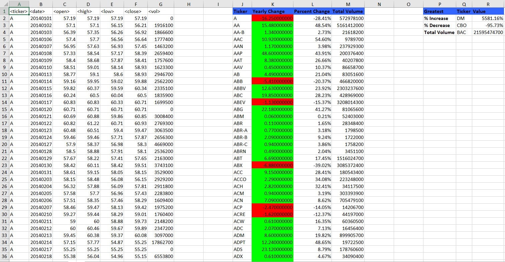
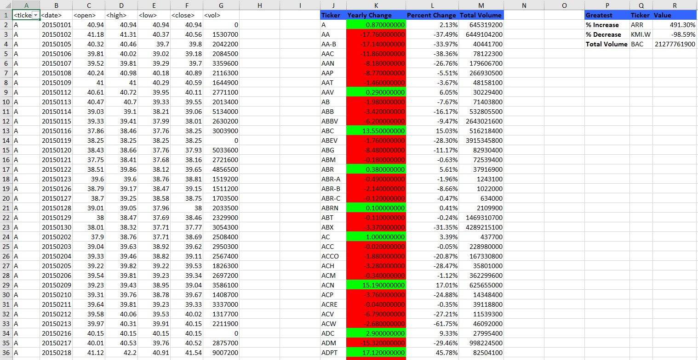
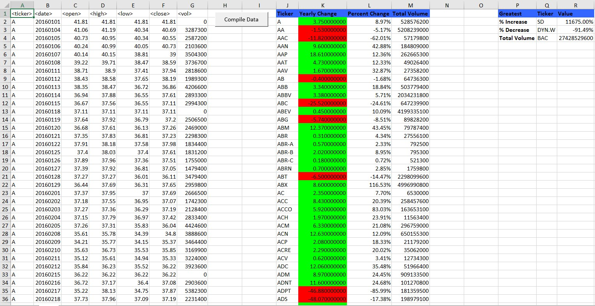

## Sep 05 Assignment - VBA Scripting

### Stock Data
Macro Enabled Excel File with output

### Stock Data - VBA Script
VBA script to compile the Stock data as required

### Screenshots for each year
**2014** 

**2015** 

**2016** 

## Instructions

* Create a script that will loop through all the stocks for one year for each run and take the following information.

  * The ticker symbol.

  * Yearly change from opening price at the beginning of a given year to the closing price at the end of that year.

  * The percent change from opening price at the beginning of a given year to the closing price at the end of that year.

  * The total stock volume of the stock.

* You should also have conditional formatting that will highlight positive change in green and negative change in red.

### CHALLENGES

* Your solution will also be able to return the stock with the "Greatest % increase", "Greatest % Decrease" and "Greatest total volume".

* Make the appropriate adjustments to your VBA script that will allow it to run on every worksheet, i.e., every year, just by running the VBA script once.
