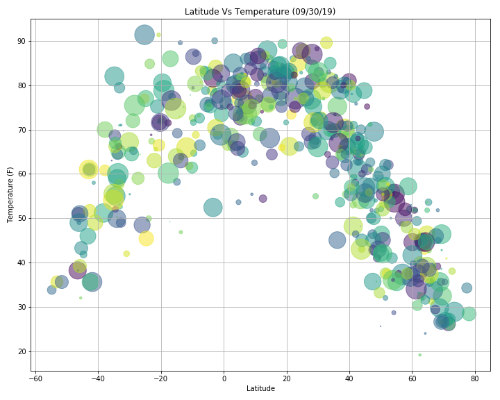
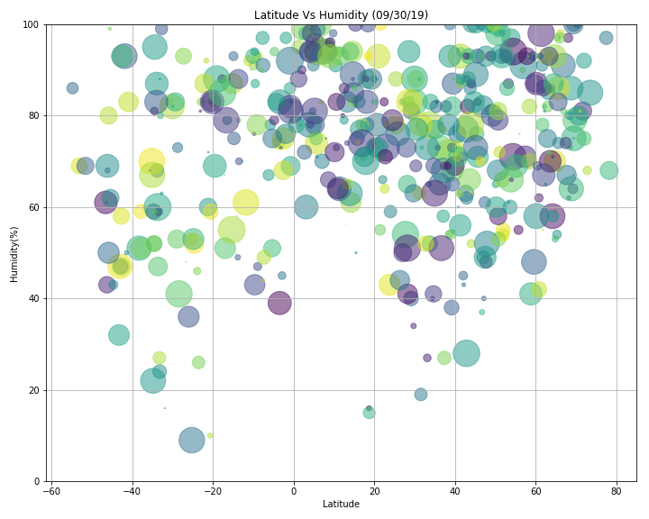
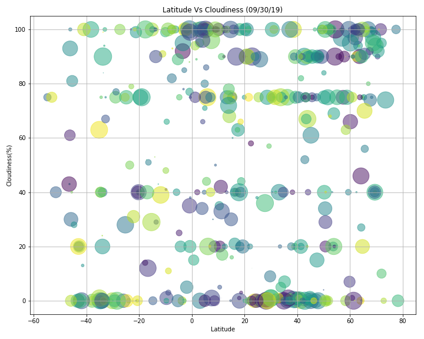

# WeatherPy Analysis
### Source Geographic Coordinate System

http://desktop.arcgis.com/en/arcmap/10.3/guide-books/map-projections/about-geographic-coordinate-systems.htm
Latitude and longitude values are traditionally measured either in decimal degrees or in degrees, minutes, and seconds (DMS). **Latitude** values are measured relative to the **equator** and **range from -90° at the South Pole to +90° at the North Pole**. **Longitude** values are measured relative to the **prime meridian**. They **range from -180° when traveling west to 180° when traveling east**. If the prime meridian is at Greenwich, then Australia, which is south of the equator and east of Greenwich, has positive longitude values and negative latitude values.

* The bell curve shows the normal distribution of temprature in correlation with Latitude values. The weather is warmer near the **equator**.

* There is not much correlation between Latitude and Humidity. But in cities north to the **equator** have the dense clustor of humidity above 50%.

* There is not much correlation between Latitude and Cloudiness. But in cities north to the **equator** have the strong clustor of cloudiness above 80%.

